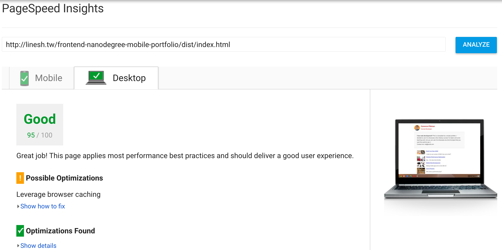

## Website Performance Optimization portfolio project

## Tasking

* [x] 环境配置
	* [x] 配置 `grunt`
	* [x] 配置 `grunt-pagespeed`
	* [x] 配置 `ngrok`
	* [x] 添加 npm scripts - psi, psi:watch, build, build:watch  
* PageSpeed score - Critical Rendering Path
	* [x] `index.html` 应该在 PageSpeed 的 desktop 评测上获得90以上的得分
	* [x] `index.html` 应该在 PageSpeed 的 mobile 评测上获得90以上的得分
* Fps Optimization
	* [ ] 优化 `views/js/main.js`，使 `views/pizza.html` 在 **滚动时** 能 **稳定** 达到 **`60fps`** 的渲染率
	* [ ] 优化 `views/pizza.html` 使其 resize 时间小于 `5ms`
* Styleguide
	* [ ] 必须有 `README.md`，里面必须包含：
		* [ ] 安装、运行测试或构建的命令
		* [ ] 所做的优化和分析
	* [ ] `views/js/main.js` 中关于 `pizza.html` 的注释必须保存
	* [ ] 使用构建工具，如 `Grunt` 或 `Gulp` 等
	* [ ] 必须包含 `package.json`、`src`及`dist`文件夹

## PageSpeed Insights




## Critical Rendering Path Optimization Tasking 

* [ ] Minification
  * [x] HTML
    * [x] basic minification - htmlmin html-minifier
    * [x] JS 代码中的注释没移除 - minifyJS: true
    * [x] JS 代码还有换行和空格 - minifyJS: true
  * [ ] CSS
    * [x] basic minification - cssmin
    * [ ] `dist/pizza/css/main.min.css` 还有注释
  * [ ] JavaScript
  * [ ] Images 
* [ ] Uglification
  * [ ] JavaScript
* [ ] Compress
  * [ ] GZip HTML
  * [ ] GZip CSS
  * [ ] GZip JavaScript
  * [ ] Images 
* [ ] Combine critical resource
  * [ ] CSS
  * [ ] JavaScript
* [ ] Defer and asynchronously load non-critical resource
  * [ ] CSS
    * [ ] 将 render blocking CSS 放在页面底端
  * [ ] JavaScript
* [ ] Cache
  * [ ] HTML
  * [ ] CSS
  * [ ] JavaScript 
  * [ ] Images
* [ ] Others
  * [ ] Optimize online fonts 
  * [ ] Optimize online images 

## Resources

* https://github.com/gruntjs/grunt-contrib-imagemin
* https://github.com/imagemin/imagemin-mozjpeg
* https://github.com/gruntjs/grunt-contrib-htmlmin
* https://github.com/kangax/html-minifier
* grunt htmlmin vs minify html: http://inspire.blufra.me/html-minifiers-grunt-contrib-htmlmin-vs-grunt-minify-html/
* http://www.cnblogs.com/hubcarl/p/4095122.html
* https://github.com/yeoman/grunt-usemin
* https://github.com/gruntjs/grunt-contrib-uglify

---

Your challenge, if you wish to accept it (and we sure hope you will), is to optimize this online portfolio for speed! In particular, optimize the critical rendering path and make this page render as quickly as possible by applying the techniques you've picked up in the [Critical Rendering Path course](https://www.udacity.com/course/ud884).

To get started, check out the repository and inspect the code.

### Getting started

#### Part 1: Optimize PageSpeed Insights score for index.html

Some useful tips to help you get started:

1. Check out the repository
1. To inspect the site on your phone, you can run a local server

  ```bash
  $> cd /path/to/your-project-folder
  $> python -m SimpleHTTPServer 8080
  ```

1. Open a browser and visit localhost:8080
1. Download and install [ngrok](https://ngrok.com/) to the top-level of your project directory to make your local server accessible remotely.

  ``` bash
  $> cd /path/to/your-project-folder
  $> ./ngrok http 8080
  ```

1. Copy the public URL ngrok gives you and try running it through PageSpeed Insights! Optional: [More on integrating ngrok, Grunt and PageSpeed.](http://www.jamescryer.com/2014/06/12/grunt-pagespeed-and-ngrok-locally-testing/)

Profile, optimize, measure... and then lather, rinse, and repeat. Good luck!

#### Part 2: Optimize Frames per Second in pizza.html

To optimize views/pizza.html, you will need to modify views/js/main.js until your frames per second rate is 60 fps or higher. You will find instructive comments in main.js. 

You might find the FPS Counter/HUD Display useful in Chrome developer tools described here: [Chrome Dev Tools tips-and-tricks](https://developer.chrome.com/devtools/docs/tips-and-tricks).

### Optimization Tips and Tricks
* [Optimizing Performance](https://developers.google.com/web/fundamentals/performance/ "web performance")
* [Analyzing the Critical Rendering Path](https://developers.google.com/web/fundamentals/performance/critical-rendering-path/analyzing-crp.html "analyzing crp")
* [Optimizing the Critical Rendering Path](https://developers.google.com/web/fundamentals/performance/critical-rendering-path/optimizing-critical-rendering-path.html "optimize the crp!")
* [Avoiding Rendering Blocking CSS](https://developers.google.com/web/fundamentals/performance/critical-rendering-path/render-blocking-css.html "render blocking css")
* [Optimizing JavaScript](https://developers.google.com/web/fundamentals/performance/critical-rendering-path/adding-interactivity-with-javascript.html "javascript")
* [Measuring with Navigation Timing](https://developers.google.com/web/fundamentals/performance/critical-rendering-path/measure-crp.html "nav timing api"). We didn't cover the Navigation Timing API in the first two lessons but it's an incredibly useful tool for automated page profiling. I highly recommend reading.
* <a href="https://developers.google.com/web/fundamentals/performance/optimizing-content-efficiency/eliminate-downloads.html">The fewer the downloads, the better</a>
* <a href="https://developers.google.com/web/fundamentals/performance/optimizing-content-efficiency/optimize-encoding-and-transfer.html">Reduce the size of text</a>
* <a href="https://developers.google.com/web/fundamentals/performance/optimizing-content-efficiency/image-optimization.html">Optimize images</a>
* <a href="https://developers.google.com/web/fundamentals/performance/optimizing-content-efficiency/http-caching.html">HTTP caching</a>

### Customization with Bootstrap
The portfolio was built on Twitter's <a href="http://getbootstrap.com/">Bootstrap</a> framework. All custom styles are in `dist/css/portfolio.css` in the portfolio repo.

* <a href="http://getbootstrap.com/css/">Bootstrap's CSS Classes</a>
* <a href="http://getbootstrap.com/components/">Bootstrap's Components</a>
