# Website Performance Optimization portfolio project

Udacity's [Front-End Web Developer Nanodegree][]. The task was to optimize a provided website with a number of optimization and performance-related issues so that it achieves a target PageSpeed score and runs at 60 frames per second. 

## Category 目录

* [Getting Started 安装指南](#getting-started)
* [Critical Rendering Path Optimization 关键渲染路径优化](#critical-rendering-path-optimization)
* [Hitting 60 FPS 向 60 FPS 进发](#hitting-60-fps)
* [Resized Pizza 调整 Pizza 大小](#resized-pizza)
* [Developer Experience 开发者体验](#developer-experience)
* [Tasking 任务分解](#tasking)
* [Optimization Tips and Tricks 优化建议与参考资料](#optimization-tips-and-tricks)

## Getting Started 安装指南

Visit [the homepage][index page] and the [pizza page][] here!

This project is built with NPM and Grunt. Follow the steps below to start the project locally and play around:  

1. download the project to your machine by `git clone`
2. open your terminal and run `npm install` on project root, by doing this make sure you have a global npm installed
3. run `npm run build:watch` to build latest assets and watch for upcoming changes
4. open another terminal and run `npm run serve` to start a local dev server on port 8080
5. open your favorite browser and visit `localhost:8080/dist/index.html`

这里是 [主页][index page]，点击这里访问 [pizza 页面][pizza page]！

项目是基于 NPM 和 Grunt 构建的。你可以按下列步骤在本地启动项目并访问：

1. 通过 `git clone` 下载项目到本地
2. 打开控制台，在项目根目录下运行 `npm install`。请确保你事先安装了一个全局的 NPM
3. 在项目根目录下运行 `npm run build:watch`，该命令会构建出最新的文件，并且在你修改了文件时进行监听并实时执行构建
4. 打开另一个控制台，在项目根目录下运行 `npm run serve`，该命令会在本地 8080 端口起一个服务器
5. 在浏览器中打开 `localhost:8080/dist/index.html` 进行访问

## Critical Rendering Path Optimization 关键渲染路径优化

There're a lot of optimizations performed to achieve a better PageSpeed score. I've summarized the best practice [here][CRP best practice] and listed all the performed optimizations below. And all of them are being automated using Grunt. 

Cache optimization seems pretty much out of my scope as the content is hosted in Github Pages and there's nothing I can do about it. But the score still hits 90+ with all those optimization that have been done and listed above.  

| Categories | Optimizations | HTML | CSS | JS | image |
| :---: | :---: | :---: | :---: | :---: | :---: | 
| eliminate requests | cache | | | | | 
|                | inline critical resource | | ✅ | ✅ | | 
| minimize critical resource path | concat critical resources | | ✅ | ✅ | |
|                   | load non-critical resources asychronously | | ✅ | ✅ | |
| minimize critical resource size | minify | ✅ | ✅ | ✅ | ✅ |
|                               | uglify | | | ✅ | |
|                               | compress | ✅ | ✅ | ✅ | ✅ |

为了在 PageSpeed 上跑分超过90，项目采用了多种优化手段。我在 [这里][CRP best practice] 总结了一些优化的最佳实践，并把项目用到的优化实践列于下表。有技术含量（其实也没太多）的是，所有这些优化都是使用 Grunt 进行了自动化的。

由于页面是托管在 Github Pages 上，我无法告诉服务器为页面的特定资源进行「缓存」，也不能指定缓存策略。不过跑分还是能达到90分以上了。

| 思想 | 优化手段 | HTML | CSS | JS | 图片 |
| :---: | :---: | :---: | :---: | :---: | :---: | 
| 消灭请求 | 缓存 | | | | | 
|         | 内联 critical 资源 | | ✅ | ✅ | | 
| 减少 critical 资源数量 | 合并 critical 资源 | | ✅ | ✅ | |
|                   | 异步下载并加载非 critical 资源 | | ✅ | ✅ | |
| 减少 critical 资源体积 | minify | ✅ | ✅ | ✅ | ✅ |
|                               | uglify | | | ✅ | |
|                               | 压缩 | ✅ | ✅ | ✅ | ✅ |

## Hitting 60 FPS 向 60 FPS 进发

###### Fps before any fixes 未修复前的 fps 

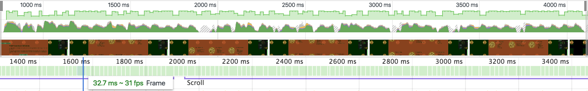

###### After extracting `document.body.scrollTop / 1250` outside of the loop 将 `document.body.scrollTop / 1250` 抽取到循环外

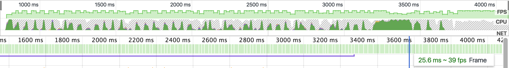

###### Reduce generated pizza numbers from 200 to 45 将自动生成的 pizza 数量从200减少到45

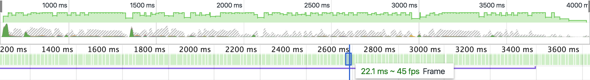

###### Use `will-change: transform` on background images 使用 `will-change: transform` 为背景图片创建新层

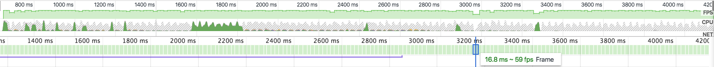

###### Apply `z-index: -1` on top of background images layer 

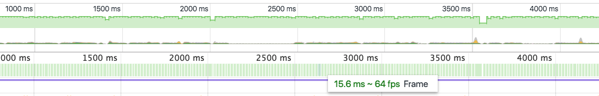

###### `requestAnimationFrame(updatePosition)` on `scroll` event 在滚动事件上使用 `requestAnimationFrame()` 调度 JS

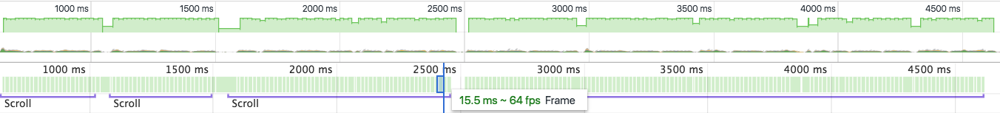

## Resized Pizza 调整 Pizza 大小 

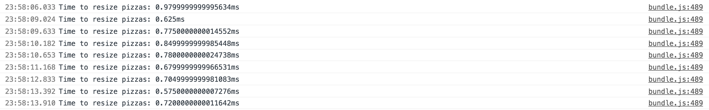

## Developer Experience 开发者体验

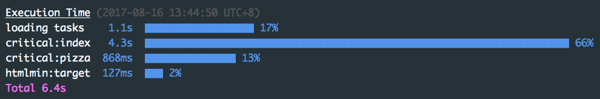

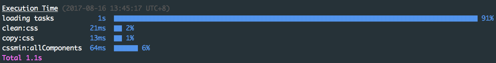

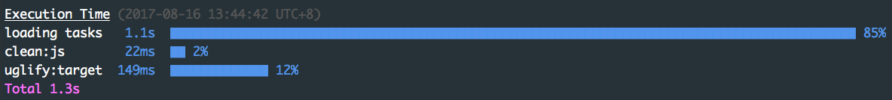

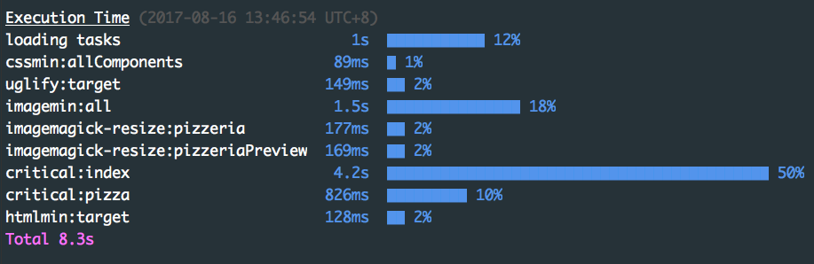

## Tasking 任务分解

* [x] 阅读 [作业要求][] 
* [x] 必须包含 `src` 及 `dist` 文件夹
* [x] 如果使用了构建工具，必须包含 `package.json` 和 `Gruntfile.js` 配置文件
* [x] 不应该提交 `node_modules` 文件夹
* [x] Github 仓库的主分支应该是 master 分支（不知道这个什么意思）
* [x] 如果使用了构建工具，review 的是 `dist` 文件夹里的内容
* [x] PageSpeed score - Critical Rendering Path
  * [x] `index.html` 应该在 PageSpeed 的 desktop 评测上获得90以上的得分
  * [x] `index.html` 应该在 PageSpeed 的 mobile 评测上获得90以上的得分
* [x] Hitting 60 fps
  * [x] 优化 `views/js/main.js`，使 `views/pizza.html` 在 **滚动时** 能 **稳定** 达到 **`60fps`** 的渲染率
  * [x] 优化 `views/pizza.html` 使其 resize 时间小于 `5ms
* [x] 必须有 `README.md`，里面必须包含：
  * [x] 安装、运行测试或构建的命令
  * [x] 所做的优化、分析、截图
  * [x] crp 
  * [x] 60fps
* [x] 必须通过 JS 风格检查
* [x] `views/js/main.js` 中关于 `pizza.html` 的注释必须保存 - 我不删
* [x] 使用构建工具，如 `Grunt` 或 `Gulp` 等

## Optimization Tips and Tricks 优化建议与参考资料

* [Measuring with Navigation Timing][] 
* [Optimize images][]
* [HTTP caching][]

---

[Front-End Web Developer Nanodegree]: https://www.udacity.com/course/front-end-web-developer-nanodegree--nd001
[作业要求]: https://review.udacity.com/#!/projects/2735848561/rubric
[Measuring with Navigation Timing]: https://developers.google.com/web/fundamentals/performance/critical-rendering-path/measure-crp.html
[Optimize images]: https://developers.google.com/web/fundamentals/performance/optimizing-content-efficiency/image-optimization.html
[HTTP caching]: https://developers.google.com/web/fundamentals/performance/optimizing-content-efficiency/http-caching.html

[index page]: http://linesh.tw/frontend-nanodegree-mobile-portfolio/dist/index.html
[pizza page]: http://linesh.tw/frontend-nanodegree-mobile-portfolio/dist/pizza/pizza.html

[CRP best practice]: https://github.com/linesh-simplicity/linesh-simplicity.github.io/issues/159
